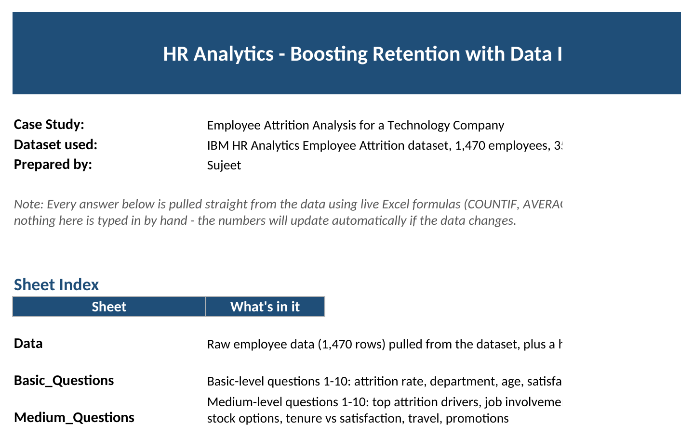
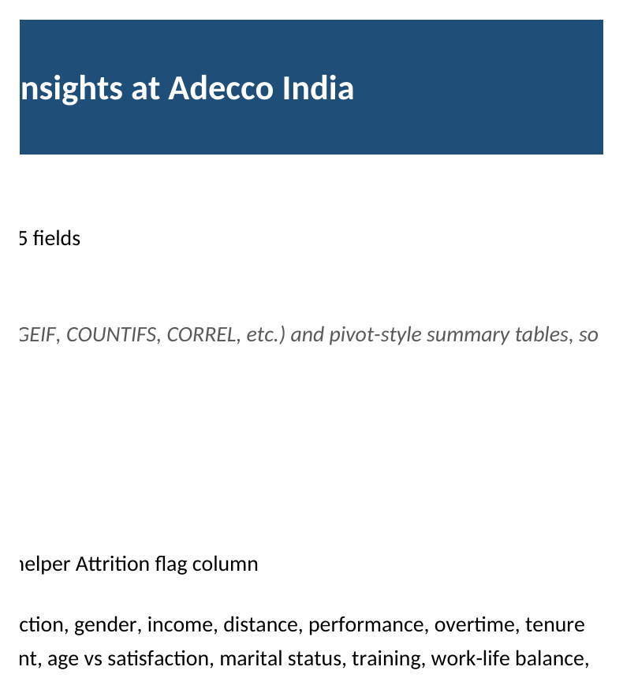
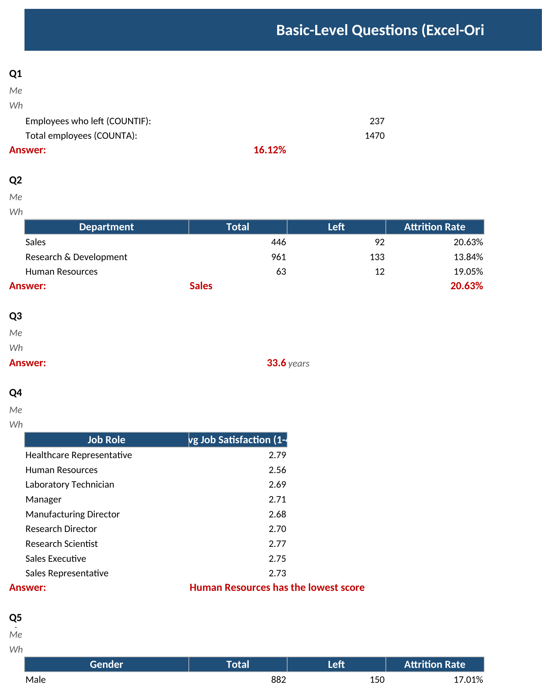
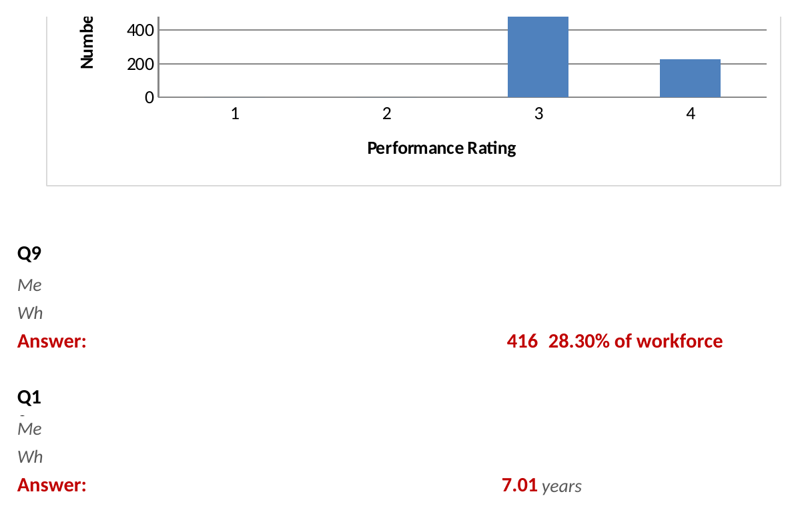
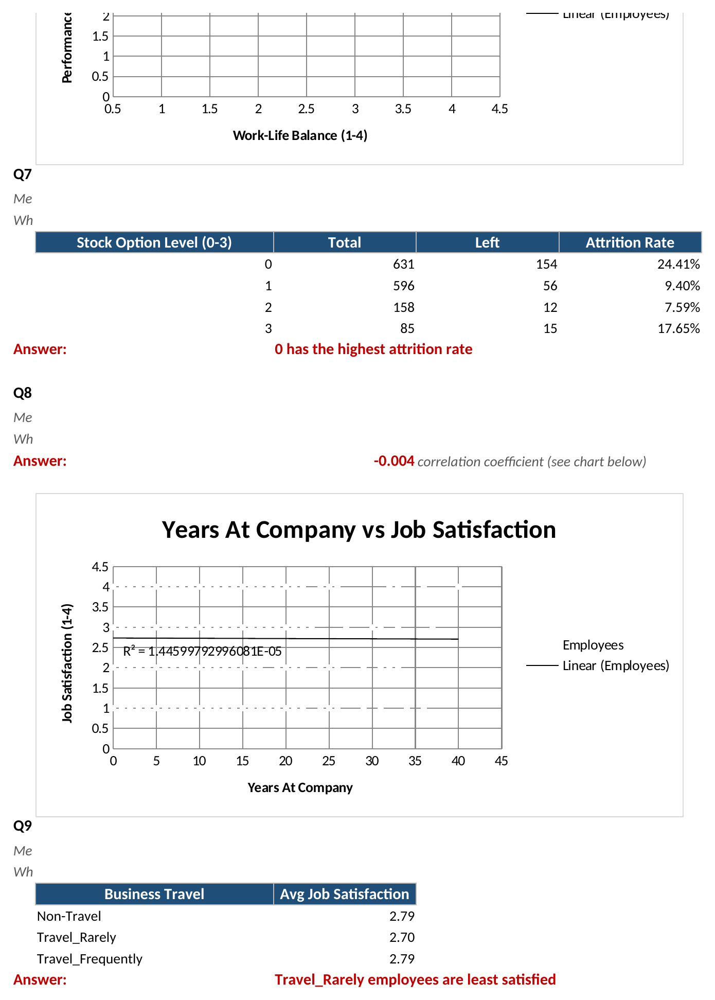
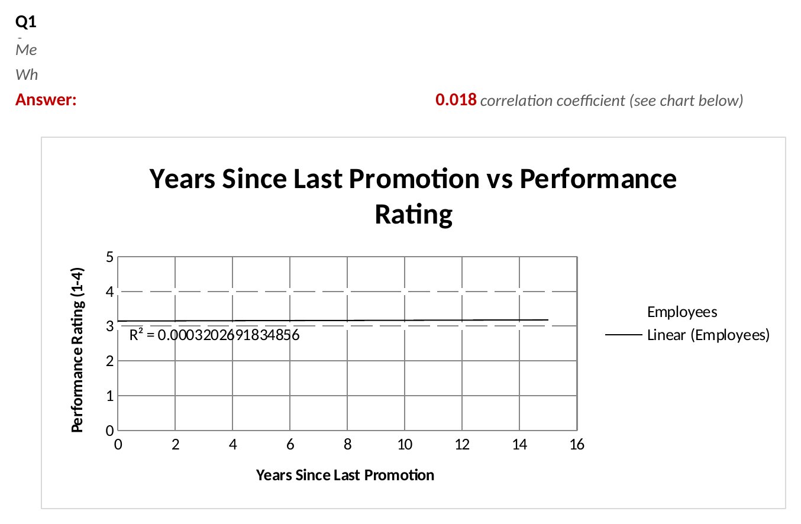

# HR Analytics – Boosting Retention with Data Insights at Adecco India

An Excel-based case study analyzing employee attrition for a mid-sized technology company (Adecco India), 
built on the **IBM HR Analytics Employee Attrition dataset** (1,470 employees, 35 fields).

## 📌 Problem Statement
Adecco India is facing high employee turnover, especially among junior-level employees in the sales 
department. This project analyzes HR data to uncover the key factors driving attrition and provides 
data-backed insights to support retention strategy.

## 📂 Files in this repo
| File | Description |
|---|---|
| [`Case_Study_Doc.pdf`](./Case_Study_Doc.pdf) | Original case study brief with problem statement, data dictionary, and questions |
| [`HR_Employee_Attrition_Dataset.csv`](./HR_Employee_Attrition_Dataset.csv) | Raw dataset — 1,470 employee records, 35 fields |
| [`DACS12_Adecco_HR_Analytics_Solved.xlsx`](./DACS12_Adecco_HR_Analytics_Solved.xlsx) | Fully solved Excel workbook with formulas, tables, and charts |
| `1_cover_sheet.png` – `6_medium_chart.png` | Screenshots of the solved workbook |

## 🧰 Tools Used
- Microsoft Excel (formulas, PivotTable-style summaries, charts, trendlines)

## 📊 Workbook structure
- **Cover** – project summary and sheet index
- **Data** – 1,470 employee records with a helper Attrition flag column
- **Basic_Questions** – 10 basic-level questions (attrition rate, department, gender, income, etc.)
- **Medium_Questions** – 10 medium-level questions (correlation analysis, job involvement, training impact, etc.)

Every answer is calculated with **live Excel formulas** (COUNTIF, COUNTIFS, AVERAGEIF, CORREL) — nothing 
is hardcoded, so the numbers update automatically if the underlying data changes.

## 🔍 Key Insights
- Overall attrition rate: **16.12%**
- Sales department has the highest attrition rate at **20.63%**
- Employees with 0 stock options have the highest attrition (**24.41%**)
- Top correlated factors with attrition: Total Working Years, Monthly Income, Age

## 🖼️ Preview

**Cover Sheet**

**Data Sheet**

**Basic-Level Questions**

**Medium-Level Questions**

 
